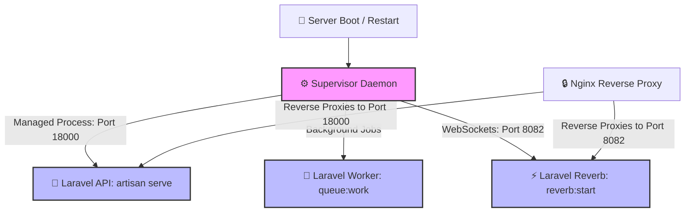

# 🐘 Laravel API — Supervisor Process Management & Deployment Guide

This documentation guides you through setting up **Supervisor** to daemonize, monitor, and auto-restart the Laravel **API** (Port **18000**), **Background Queue Workers**, and **Laravel Reverb (WebSocket Server on Port 8082)** in production.

---

## 🏗️ Process Architecture Flow

Supervisor runs as a system daemon (`supervisord`), ensuring that all three Laravel services boot on server restart and self-heal automatically if a process crashes.



---

> [!IMPORTANT]
> **Path & User:**
> - Project Directory: `/home/jervi/projects/dropjdid-v2/api`
> - Execution User: `jervi`

---

## ⚙️ Supervisor Configuration

You can place each service in its own file under `/etc/supervisor/conf.d/`.

### 1️⃣ Laravel Web Server (`dropjdid-api.conf`)

Serves the HTTP application on `127.0.0.1:18000`:

```bash
sudo nano /etc/supervisor/conf.d/dropjdid-api.conf
```

```ini
[program:dropjdid-api]
process_name=%(program_name)s_%(process_num)02d
command=php /home/jervi/projects/dropjdid-v2/api/artisan octane:start --server=roadrunner --host=127.0.0.1 --port=18000
directory=/home/jervi/projects/dropjdid-v2/api
autostart=true
autorestart=true
user=jervi
numprocs=1
redirect_stderr=true
stdout_logfile=/var/log/supervisor/dropjdid-api.log
stopsignal=INT
stopwaitsecs=30
```

### Reverb

```bash
sudo nano /etc/supervisor/conf.d/dropjdid-reverb.conf
```

```ini
[program:dropjdid-reverb]
process_name=%(program_name)s_%(process_num)02d
command=php /home/jervi/projects/dropjdid-v2/api/artisan reverb:start --host=127.0.0.1 --port=18001
directory=/home/jervi/projects/dropjdid-v2/api
autostart=true
autorestart=true
user=jervi
numprocs=1
redirect_stderr=true
stdout_logfile=/var/log/supervisor/dropjdid-reverb.log
stopsignal=INT
```

---

### 2️⃣ Laravel Queue Worker (`dropjdid-worker.conf`)

Processes asynchronous background jobs, queued notifications, and database events:

```bash
sudo nano /etc/supervisor/conf.d/dropjdid-worker.conf
```

```ini
[program:dropjdid-worker]
process_name=%(program_name)s_%(process_num)02d
command=php /home/jervi/projects/dropjdid-v2/api/artisan queue:work --sleep=3 --tries=3 --max-time=3600
directory=/home/jervi/projects/dropjdid-v2/api
autostart=true
autorestart=true
stopasgroup=true
killasgroup=true
user=jervi
numprocs=2
redirect_stderr=true
stdout_logfile=/var/log/supervisor/dropjdid-worker.log
stopwaitsecs=3600
```

---

### 3️⃣ Laravel Reverb WebSocket Server (`dropjdid-reverb.conf`)

Runs the real-time WebSocket server on `0.0.0.0:8082`:

```bash
sudo nano /etc/supervisor/conf.d/dropjdid-reverb.conf
```

```ini
[program:dropjdid-reverb]
process_name=%(program_name)s_%(process_num)02d
command=php /home/jervi/projects/dropjdid-v2/api/artisan reverb:start --host=0.0.0.0 --port=8082
directory=/home/jervi/projects/dropjdid-v2/api
autostart=true
autorestart=true
stopasgroup=true
killasgroup=true
user=jervi
numprocs=1
redirect_stderr=true
stdout_logfile=/var/log/supervisor/dropjdid-reverb.log
```

---

## 🚀 Activation & Reloading

After creating or modifying the `.conf` files, tell Supervisor to reload and start the processes:

```bash
sudo supervisorctl reread
sudo supervisorctl update
sudo supervisorctl status
```

---

## 🔄 Management & Monitoring Commands

| Action | Supervisor Command |
| :--- | :--- |
| **Check Status** | `sudo supervisorctl status` |
| **Restart Web API** | `sudo supervisorctl restart dropjdid-api:*` |
| **Restart Queue Worker** | `sudo supervisorctl restart dropjdid-worker:*` |
| **Restart Reverb** | `sudo supervisorctl restart dropjdid-reverb:*` |
| **Restart All Services** | `sudo supervisorctl restart dropjdid-api:* dropjdid-worker:* dropjdid-reverb:*` |
| **Stop All Services** | `sudo supervisorctl stop dropjdid-api:* dropjdid-worker:* dropjdid-reverb:*` |
| **Start All Services** | `sudo supervisorctl start dropjdid-api:* dropjdid-worker:* dropjdid-reverb:*` |
| **Stream Live Logs (API)** | `sudo supervisorctl tail -f dropjdid-api:dropjdid-api_00` |
| **Stream Live Logs (Worker)** | `sudo supervisorctl tail -f dropjdid-worker:dropjdid-worker_00` |
| **Stream Live Logs (Reverb)** | `sudo supervisorctl tail -f dropjdid-reverb:dropjdid-reverb_00` |

---

## 🚀 Production Deployment Sequence

Add this sequence to your deployment pipeline whenever code updates are pulled:

```bash
cd /home/jervi/projects/dropjdid-v2/api

# 1. Update dependencies & database
composer install --no-dev --optimize-autoloader
php artisan migrate --force

# 2. Refresh application cache
php artisan config:cache
php artisan route:cache
php artisan view:cache

# 3. Gracefully restart workers and API services
php artisan queue:restart
sudo supervisorctl restart dropjdid-api:* dropjdid-worker:* dropjdid-reverb:*
```