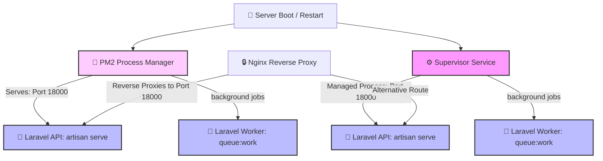

# 🐘 Laravel API — Process Management & Deployment Guide

This documentation guides you through setting up process managers to daemonize, monitor, and run the Laravel **API** (running on **Port 18000**) and its background **Queue Workers** in production.

We provide two production-grade process management options:
1. **PM2** (Recommended - features consolidated process management, built-in resource monitoring, and easy logs).
2. **Supervisor** (Robust system-level manager - aligns with standard Linux system service architectures).

---

## 🏗️ Process Architecture Flow

Using a process manager ensures that your Laravel web server and background queue workers automatically boot on system restart and self-heal (restart) immediately if they crash.



---

> [!IMPORTANT]
> **Path Dependency Warning:**
> All configurations below depend on the absolute path of your project's Laravel directory.
> - The default workspace path is `/home/jervi/projects/dropjdid-api/laravel`.
> - If deploying to a production server (e.g., `/var/www/dropjdid/servers/laravel`), make sure to replace `/home/jervi/projects/dropjdid-api/laravel` in all configuration files with your actual target installation path.

---

## 🚀 Option 1: PM2 Deployment (Recommended)

PM2 can manage PHP processes using a custom interpreter config. Using a unified `ecosystem.config.cjs` allows you to manage both the web server and background workers with a single command dashboard.

### 1️⃣ PM2 Ecosystem Configuration File (`ecosystem.config.cjs`)

Create (or use the existing) `ecosystem.config.cjs` at the root of `laravel/`:

```javascript
module.exports = {
  apps: [
    {
      name: 'dropjdid:laravel-api',
      script: 'artisan',
      interpreter: 'php',
      args: 'serve --host=127.0.0.1 --port=18000',
      cwd: '/home/jervi/projects/dropjdid-api/laravel',
      instances: 1,
      exec_mode: 'fork',
      watch: false,
      max_memory_restart: '512M',
      env: {
        APP_ENV: 'production',
      },
    },
    {
      name: 'dropjdid:laravel-worker',
      script: 'artisan',
      interpreter: 'php',
      args: 'queue:work --sleep=3 --tries=3 --max-time=3600',
      cwd: '/home/jervi/projects/dropjdid-api/laravel',
      instances: 1,
      exec_mode: 'fork',
      watch: false,
      max_memory_restart: '512M',
      env: {
        APP_ENV: 'production',
      },
    },
  ],
};
```

### 2️⃣ Step-by-Step PM2 Setup

1. **Install PM2 globally:**
   ```bash
   sudo npm install pm2 -g
   ```
2. **Navigate to the Laravel directory:**
   ```bash
   cd /home/jervi/projects/dropjdid-api/laravel
   ```
3. **Start the Laravel API & Queue Worker using PM2:**
   ```bash
   pm2 start ecosystem.config.cjs
   ```
4. **Configure PM2 to start on system boot:**
   ```bash
   pm2 startup
   ```
   > [!NOTE]
   > Execute the exact command generated and displayed on your screen by `pm2 startup` to register PM2 as a systemd service.
5. **Save the running process list so it persists across reboots:**
   ```bash
   pm2 save
   ```

---

## ⚙️ Option 2: Supervisor Deployment

Supervisor is a robust, system-level process manager. It ensures your services run continuously as system daemons.

### 1️⃣ Laravel Web Server Configuration (`laravel-api.conf`)

This daemonizes `php artisan serve` to listen on port `18000`.

```bash
sudo nano /etc/supervisor/conf.d/laravel-api.conf
```

And paste the following configuration:
```ini
[program:laravel-api]
process_name=%(program_name)s_%(process_num)02d
command=php /home/jervi/projects/dropjdid-api/laravel/artisan serve --host=127.0.0.1 --port=18000
directory=/home/jervi/projects/dropjdid-api/laravel
autostart=true
autorestart=true
user=www-data
numprocs=1
redirect_stderr=true
stdout_logfile=/var/log/supervisor/laravel-api-stdout.log
stderr_logfile=/var/log/supervisor/laravel-api-stderr.log
stopsignal=INT
```

### 2️⃣ Laravel Queue Worker Configuration (`laravel-worker.conf`)

Highly recommended to process background events, notifications, and database heavy-lifting.

```bash
sudo nano /etc/supervisor/conf.d/laravel-worker.conf
```

And paste the following configuration:
```ini
[program:laravel-worker]
process_name=%(program_name)s_%(process_num)02d
command=php /home/jervi/projects/dropjdid-api/laravel/artisan queue:work --sleep=3 --tries=3 --max-time=3600
directory=/home/jervi/projects/dropjdid-api/laravel
autostart=true
autorestart=true
stopasgroup=true
killasgroup=true
user=www-data
numprocs=2
redirect_stderr=true
stdout_logfile=/var/log/supervisor/laravel-worker.log
stopwaitsecs=3600
```

### 3️⃣ Step-by-Step Supervisor Setup

1. **Reread the new configuration files:**
   ```bash
   sudo supervisorctl reread
   ```
2. **Apply updates and start processes:**
   ```bash
   sudo supervisorctl update
   ```

---

## 🔄 Management & Monitoring Commands

Use the respective commands depending on which process manager you opted for:

| Management Action | 🚀 PM2 Command | ⚙️ Supervisor Command |
| :--- | :--- | :--- |
| **Status / List** | `pm2 list` or `pm2 status` | `sudo supervisorctl status` |
| **Restart Web Server** | `pm2 restart dropjdid:laravel-api` | `sudo supervisorctl restart laravel-api:*` |
| **Restart Queue Worker** | `pm2 restart dropjdid:laravel-worker` | `sudo supervisorctl restart laravel-worker:*` |
| **Restart All Services** | `pm2 restart ecosystem.config.cjs` | `sudo supervisorctl restart all` |
| **Stop All Services** | `pm2 stop ecosystem.config.cjs` | `sudo supervisorctl stop all` |
| **View Realtime Logs** | `pm2 logs` | `tail -f /var/log/supervisor/*.log` |
| **Monitoring Dashboard** | `pm2 monit` | *N/A* |

---

## 🚀 Production Deployment Hook

When updating your Laravel application in production, integrate the following restart sequence into your deployment pipeline:

### For PM2
```bash
cd /home/jervi/projects/dropjdid-api/laravel
composer install --no-dev --optimize-autoloader
php artisan migrate --force
php artisan config:cache
php artisan route:cache
pm2 restart ecosystem.config.cjs
```

### For Supervisor
```bash
cd /home/jervi/projects/dropjdid-api/laravel
composer install --no-dev --optimize-autoloader
php artisan migrate --force
php artisan config:cache
php artisan route:cache
sudo supervisorctl restart laravel-api:* laravel-worker:*
```
