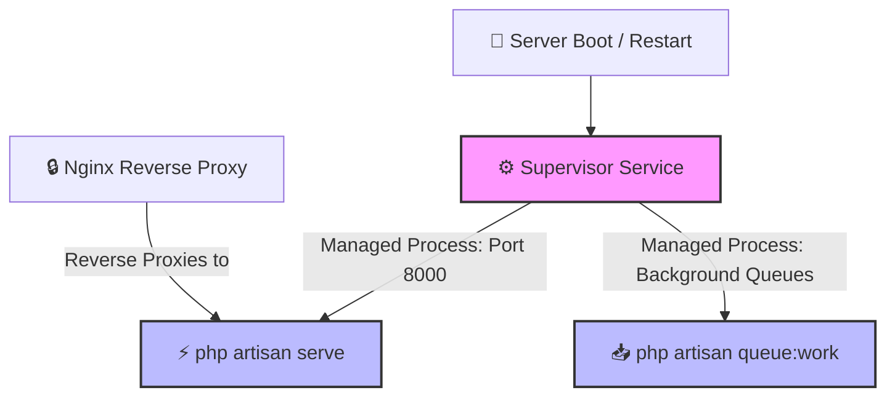

# ⚡ Laravel API — Supervisor Deployment & Process Management

This documentation guides you through the process of setting up **Supervisor** to daemonize, monitor, and run the **Laravel API Service** on **Port 8000** in a production environment.

---

## 🏗️ Process Architecture Flow

Using Supervisor ensures that your Laravel server automatically boots on system restart and self-heals (restarts) immediately if it crashes.



---

## 📄 Supervisor Configurations

Below are the production-grade Supervisor configurations. We provide configurations for both the **API Web Server** (serving on port 8000) and the **Queue Workers** (critical for handling emails, background jobs, and system events).

> [!IMPORTANT]
> Change the paths (e.g. `/var/www/dropjdid`) and the execution user (`www-data`) to match your target server environment.

### 1️⃣ Laravel Web Server Configuration (`laravel-api.conf`)
This configuration daemonizes `php artisan serve` to listen on port `8000`.

```ini
[program:laravel-api]
process_name=%(program_name)s_%(process_num)02d
command=php /var/www/dropjdid/servers/laravel/artisan serve --host=127.0.0.1 --port=8000
directory=/var/www/dropjdid/servers/laravel
autostart=true
autorestart=true
user=www-data
numprocs=1
redirect_stderr=true
stdout_logfile=/var/log/supervisor/laravel-api-stdout.log
stderr_logfile=/var/log/supervisor/laravel-api-stderr.log
stopsignal=INT
```

### 2️⃣ Laravel Queue Worker Configuration (`laravel-worker.conf`)
Highly recommended for any production Laravel system to process background events, emails, and database heavy-lifting.

```ini
[program:laravel-worker]
process_name=%(program_name)s_%(process_num)02d
command=php /var/www/dropjdid/servers/laravel/artisan queue:work --sleep=3 --tries=3 --max-time=3600
directory=/var/www/dropjdid/servers/laravel
autostart=true
autorestart=true
stopasgroup=true
killasgroup=true
user=www-data
numprocs=2
redirect_stderr=true
stdout_logfile=/var/log/supervisor/laravel-worker.log
stopwaitsecs=3600
```

---

## 🛠️ Step-by-Step Installation & Setup

Follow these steps to deploy and activate the Supervisor configurations on your target server.

### Step 1: Install Supervisor
Install Supervisor via your Linux distribution's package manager:
```bash
sudo apt update
sudo apt install supervisor -y
```

### Step 2: Configure Folder Permissions
Ensure that the web server user (`www-data`) has read and write permissions to the Laravel application files, especially the `storage` and `bootstrap/cache` folders:
```bash
sudo chown -R www-data:www-data /var/www/dropjdid/servers/laravel
sudo chmod -R 775 /var/www/dropjdid/servers/laravel/storage
sudo chmod -R 775 /var/www/dropjdid/servers/laravel/bootstrap/cache
```

### Step 3: Write Supervisor Config Files
Create the Supervisor configuration files inside the `/etc/supervisor/conf.d/` directory:

1. **For the Web Server:**
   ```bash
   sudo nano /etc/supervisor/conf.d/laravel-api.conf
   ```
   Paste the content of **Laravel Web Server Configuration** shown above.

2. **For the Queue Worker (Optional but Recommended):**
   ```bash
   sudo nano /etc/supervisor/conf.d/laravel-worker.conf
   ```
   Paste the content of **Laravel Queue Worker Configuration** shown above.

### Step 4: Create Log Files (If they do not exist)
Make sure the Supervisor log files are created and writable:
```bash
sudo touch /var/log/supervisor/laravel-api-stdout.log
sudo touch /var/log/supervisor/laravel-api-stderr.log
sudo touch /var/log/supervisor/laravel-worker.log
sudo chown www-data:www-data /var/log/supervisor/laravel*.log
```

### Step 5: Read and Start the Configurations
Instruct Supervisor to scan for new configuration files, apply updates, and start the processes:
```bash
sudo supervisorctl reread
sudo supervisorctl update
```

---

## 🔄 Management & Monitoring Commands

Use these commands to manage your Laravel processes on the server:

| Command | Action |
|:---|:---|
| `sudo supervisorctl status` | View the status of all managed programs |
| `sudo supervisorctl restart laravel-api:*` | Restart the Laravel API server |
| `sudo supervisorctl restart laravel-worker:*` | Restart the Queue Workers (Run after deploying new code!) |
| `sudo supervisorctl stop laravel-api:*` | Stop the API server |
| `sudo supervisorctl start laravel-api:*` | Start the API server |

> [!TIP]
> **Important CI/CD Note:** Whenever you push/deploy new code changes to your Laravel server, you **MUST** run:
> `sudo supervisorctl restart laravel-api:* laravel-worker:*`
> This ensures that the PHP process memory is cleared and your running processes load the updated codebase.

---

## 🔍 Troubleshooting

### 🛑 Issue: Process fails to start (`FATAL` or `BACKOFF`)
If `supervisorctl status` indicates that a process is not running:
1. **Check the logs:**
   ```bash
   tail -n 50 /var/log/supervisor/laravel-api-stderr.log
   # or check Laravel's application logs
   tail -n 50 /var/www/dropjdid/servers/laravel/storage/logs/laravel.log
   ```
2. **PHP Path issues:** Ensure `php` is in the system path for the `www-data` user. If you are using a custom PHP version (e.g. PHP 8.3), write the absolute path to it in the configuration:
   `command=/usr/bin/php8.3 /var/www/dropjdid/servers/laravel/artisan serve --host=127.0.0.1 --port=8000`

### 🛑 Issue: Permission Denied on Logs
Ensure Supervisor has permissions to write into the targeted log directories:
```bash
sudo chmod -R 755 /var/log/supervisor/
```
