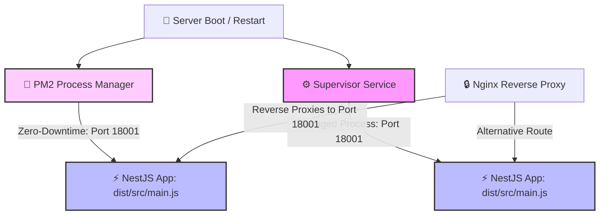

# ⚡ NestJS Media Service — Process Management & Deployment Guide

This documentation guides you through setting up process managers to daemonize, monitor, and run the NestJS **Media Service** (running on **Port 18001**) in production.

We provide two production-grade process management options:
1. **PM2** (Recommended for Node.js - features zero-downtime reloads, built-in resource monitoring, and clustering).
2. **Supervisor** (Robust system-level manager - aligns with the Laravel API deployment).

---

## 🏗️ Process Architecture Flow

Using a process manager ensures that your NestJS application automatically boots on system restart and self-heals (restarts) immediately if it crashes.



---

## 🚀 Option 1: PM2 Deployment (Recommended)

PM2 is the industry-standard process manager for Node.js applications. It offers easy scaling, log management, and **zero-downtime application reloading**.

### 1️⃣ PM2 Ecosystem Configuration File (`ecosystem.config.js`)

Create (or use the existing) `ecosystem.config.js` at the root of `media-service/`:

```javascript
module.exports = {
  apps: [
    {
      name: 'media-service',
      script: 'dist/src/main.js',
      cwd: '/home/jervi/projects/dropjdid-api/media-service',
      instances: 1,
      exec_mode: 'fork',
      watch: false,
      max_memory_restart: '1G',
      env: {
        NODE_ENV: 'production',
        PORT: '18001',
      },
    },
  ],
};
```

### 2️⃣ Step-by-Step PM2 Setup

1. **Install PM2 globally:**
   ```bash
   sudo npm install pm2 -g
   ```
2. **Build the application:**
   ```bash
   pnpm run build
   ```
3. **Start the application using the ecosystem config:**
   ```bash
   pm2 start ecosystem.config.js
   ```
4. **Configure PM2 to start on system boot:**
   ```bash
   pm2 startup
   ```
   > [!NOTE]
   > Run the command printed on your screen by `pm2 startup` (which registers PM2 as a systemd service).
5. **Save the running process list so it persists across reboots:**
   ```bash
   pm2 save
   ```

---

## ⚙️ Option 2: Supervisor Deployment

If you prefer to align with the **Laravel API** process management pattern, you can deploy using Supervisor.

### 1️⃣ Supervisor Configuration File (`media-service.conf`)

Create the configuration file inside `/etc/supervisor/conf.d/`:
```bash
sudo nano /etc/supervisor/conf.d/media-service.conf
```

And paste the following configuration:
```ini
[program:media-service]
process_name=%(program_name)s_%(process_num)02d
command=node dist/src/main.js
directory=/home/jervi/projects/dropjdid-api/media-service
autostart=true
autorestart=true
user=www-data
numprocs=1
redirect_stderr=true
stdout_logfile=/var/log/supervisor/media-service-stdout.log
stderr_logfile=/var/log/supervisor/media-service-stderr.log
environment=NODE_ENV="production",PORT="18001"
stopasgroup=true
killasgroup=true
stopwaitsecs=10
```

### 2️⃣ Step-by-Step Supervisor Setup

1. **Reread the new configuration:**
   ```bash
   sudo supervisorctl reread
   ```
2. **Update Supervisor to start the process:**
   ```bash
   sudo supervisorctl update
   ```

---

## 📁 Step 3: Configure Media Uploads Directory

Ensure that the media uploads directory exists and has correct permissions so the NestJS application (running under PM2 or Supervisor/`www-data`) can write files to it.

```bash
# Create uploads folder inside media-service
mkdir -p uploads

# Grant read/write/execute permissions to group/owner
sudo chmod -R 775 uploads
```

---

## 🔄 Management & Monitoring Commands

Use the respective commands depending on which process manager you opted for:

| Management Action | 🚀 PM2 Command | ⚙️ Supervisor Command |
| :--- | :--- | :--- |
| **Status / List** | `pm2 list` or `pm2 status` | `sudo supervisorctl status` |
| **Restart App** | `pm2 restart media-service` | `sudo supervisorctl restart media-service:*` |
| **Zero-Downtime Reload** | `pm2 reload media-service` 🚀 | *N/A (Requires Full Process Restart)* |
| **Stop App** | `pm2 stop media-service` | `sudo supervisorctl stop media-service:*` |
| **Start App** | `pm2 start media-service` | `sudo supervisorctl start media-service:*` |
| **View Realtime Logs** | `pm2 logs media-service` | `tail -f /var/log/supervisor/media-service-stdout.log` |
| **Monitoring Dashboard** | `pm2 monit` | *N/A* |

---

## 🚀 Production Deployment Hook

When setting up your CI/CD pipeline or deployment runner, add the corresponding build and reload sequence:

### For PM2 (Zero-Downtime Reload)
```bash
pnpm install --frozen-lockfile
pnpm run build
pm2 reload media-service --update-env
```

### For Supervisor
```bash
pnpm install --frozen-lockfile
pnpm run build
sudo supervisorctl restart media-service:*
```
