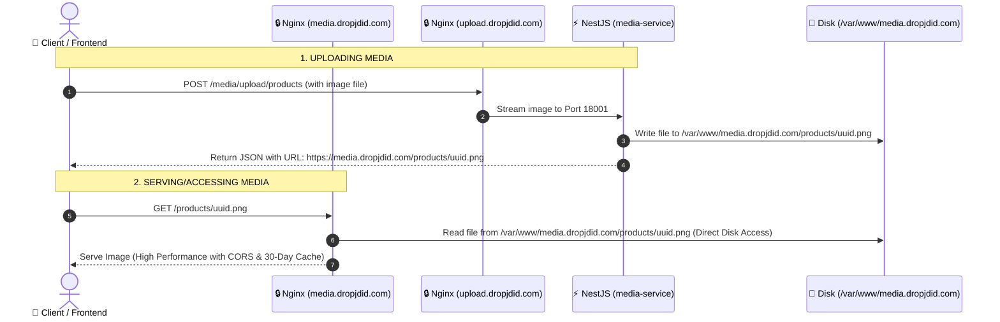

# 🖼️ High-Performance Static Media Serving — media.dropjdid.com

This document provides complete instructions for your updated architecture:
- **NestJS Server Code:** Stays inside your home directory at `/home/jervi/projects/dropjdid-api/media-service`.
- **Media Storage:** Stored directly inside `/var/www/media.dropjdid.com`, which is completely open and safe for Nginx (`www-data`) to read and write without any home folder permission issues.
- **NestJS Media Service:** Writes uploads directly into `/var/www/media.dropjdid.com` using a configurable `STORAGE_PATH` environment variable.

---

## 🏗️ Architecture Workflow



---

## 📁 Step 1: Prepare the Media Directory
Create the target `/var/www/media.dropjdid.com` directory on your server and give it the correct ownership so both NestJS (running under supervisor as `www-data`) and Nginx can read and write to it.

```bash
# Create the directory
sudo mkdir -p /var/www/media.dropjdid.com

# Give ownership to www-data (Nginx & NestJS process user)
sudo chown -R www-data:www-data /var/www/media.dropjdid.com
sudo chmod -R 775 /var/www/media.dropjdid.com
```

---

## 📄 Step 2: Nginx Configuration File (`media.conf`)

Create the Nginx configuration file for `media.dropjdid.com` on your server.

```bash
sudo nano /etc/nginx/sites-available/media.conf
```

### Paste the following configuration:

```nginx
# =========================================================================
# Nginx Configuration for media.dropjdid.com (Direct Static Serving)
# =========================================================================

# HTTP Redirect to HTTPS
server {
    listen 80;
    listen [::]:80;
    server_name media.dropjdid.com;

    # Certbot ACME Challenge directory
    location /.well-known/acme-challenge/ {
        root /var/www/certbot;
    }

    # Redirect all HTTP requests to HTTPS
    location / {
        return 301 https://$host$request_uri;
    }
}

# HTTPS Server Block (SSL/TLS)
server {
    listen 443 ssl http2;
    listen [::]:443 ssl http2;
    server_name media.dropjdid.com;

    # SSL Certificates (managed by Certbot)
    ssl_certificate /etc/letsencrypt/live/media.dropjdid.com/fullchain.pem;
    ssl_certificate_key /etc/letsencrypt/live/media.dropjdid.com/privkey.pem;
    
    # Modern SSL configuration (Mozilla Intermediate Profile)
    ssl_protocols TLSv1.2 TLSv1.3;
    ssl_prefer_server_ciphers on;
    ssl_ciphers 'ECDHE-ECDSA-AES128-GCM-SHA256:ECDHE-RSA-AES128-GCM-SHA256:ECDHE-ECDSA-AES256-GCM-SHA384:ECDHE-RSA-AES256-GCM-SHA384:DHE-RSA-AES128-GCM-SHA256:DHE-RSA-AES256-GCM-SHA384';
    
    # Session caching and timeouts
    ssl_session_cache shared:SSL:10m;
    ssl_session_timeout 1d;
    ssl_session_tickets off;

    # Security Headers
    add_header X-Frame-Options "SAMEORIGIN" always;
    add_header X-XSS-Protection "1; mode=block" always;
    add_header X-Content-Type-Options "nosniff" always;
    add_header Referrer-Policy "no-referrer-when-downgrade" always;
    add_header Strict-Transport-Security "max-age=31536000; includeSubDomains; preload" always;

    # Root directory pointing to the www media path
    root /var/www/media.dropjdid.com;

    # Serve files directly
    location / {
        try_files $uri $uri/ =404;

        # 🔓 Enable CORS for frontend applications
        add_header Access-Control-Allow-Origin "*" always;
        add_header Access-Control-Allow-Methods "GET, OPTIONS" always;
        add_header Access-Control-Allow-Headers "DNT,User-Agent,X-Requested-With,If-Modified-Since,Cache-Control,Content-Type,Range" always;

        if ($request_method = 'OPTIONS') {
            add_header Access-Control-Allow-Origin "*";
            add_header Access-Control-Allow-Methods "GET, OPTIONS";
            add_header Access-Control-Max-Age 1728000;
            add_header Content-Type 'text/plain; charset=utf-8';
            add_header Content-Length 0;
            return 204;
        }

        # 🚀 Extreme Browser Caching for Images
        expires 30d;
        add_header Cache-Control "public, no-transform";
        log_not_found off;
        access_log off;
    }

    # Prevent access to hidden files (.env, .git, etc.)
    location ~ /\. {
        deny all;
        access_log off;
        log_not_found off;
    }
}
```

---

## ⚡ Step 3: SSL/TLS Setup Steps

To deploy Nginx and issue Let's Encrypt certificates for the media domain:

### 1. Create Temporary Nginx Port 80 Block
To get the SSL certificate, Nginx must serve the domain over HTTP first so Certbot can verify ownership.

1. Write only the Port 80 portion of the configuration:
   ```nginx
   server {
       listen 80;
       listen [::]:80;
       server_name media.dropjdid.com;

       location /.well-known/acme-challenge/ {
           root /var/www/certbot;
       }

       location / {
           return 301 https://$host$request_uri;
       }
   }
   ```
2. Enable the site and test:
   ```bash
   sudo ln -sf /etc/nginx/sites-available/media.conf /etc/nginx/sites-enabled/
   sudo nginx -t
   sudo systemctl restart nginx
   ```

### 2. Issue SSL Certificate via Certbot
Run Certbot to request and generate your SSL certificates automatically:
```bash
sudo certbot certonly --webroot -w /var/www/certbot -d media.dropjdid.com --email admin@dropjdid.com --agree-tos --no-eff-email
```

### 3. Enable Complete Configuration
Now that the certificates exist at `/etc/letsencrypt/live/media.dropjdid.com/`, edit `/etc/nginx/sites-available/media.conf` and paste the full SSL-enabled code shown above.

Verify the configuration and reload Nginx:
```bash
sudo nginx -t
sudo systemctl reload nginx
```

---

## ⚙️ Step 4: NestJS Environment Setup

Update your media service environment file to specify the new `/var/www/media.dropjdid.com` storage folder and the public-facing URL domain.

1. **Open the environment file:**
   ```bash
   nano /home/jervi/projects/dropjdid-api/media-service/.env
   ```

2. **Add/Update these variables:**
   ```env
   # Path where NestJS will write files on the disk
   STORAGE_PATH=/var/www/media.dropjdid.com

   # URL domain where users will retrieve files
   STORAGE_PUBLIC_URL=https://media.dropjdid.com
   ```

3. **Rebuild the NestJS server code & restart via Supervisor to apply changes:**
   ```bash
   # Rebuild the media-service
   cd /home/jervi/projects/dropjdid-api/media-service
   pnpm run build

   # Restart NestJS to load the new env variables
   sudo supervisorctl restart media-service
   ```
