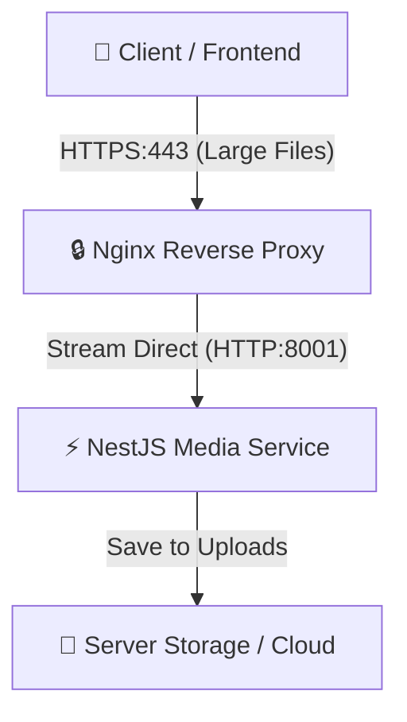

# 📤 upload.dropjdid.com — Nginx & SSL/TLS Configuration

This documentation provides the production-grade Nginx configuration, Certbot setup, and SSL/TLS deployment instructions for the **NestJS Media & Upload Service** running on **Port 8001**.

---

## 🏗️ Architecture Flow



---

## 📄 Nginx Configuration File

Below is the complete, secure, and production-optimized Nginx server block configuration.

> [!IMPORTANT]
> Since this is a high-performance **Media Upload** service, standard Nginx proxy settings can cause massive server memory spikes and performance bottlenecks.
> This configuration disables proxy request buffering (`proxy_request_buffering off`) to stream large files directly to NestJS, sets the file upload limit to `512M`, and extends connection timeouts.

### `media-service.conf`

```nginx
# =========================================================================
# Nginx Configuration for upload.dropjdid.com (NestJS Media Service - Port 8001)
# =========================================================================

# HTTP Redirect to HTTPS
server {
    listen 80;
    listen [::]:80;
    server_name upload.dropjdid.com;

    # Certbot ACME Challenge directory
    location /.well-known/acme-challenge/ {
        root /var/www/certbot;
    }

    # Redirect all HTTP requests to HTTPS
    location / {
        return 301 https://$host$request_uri;
    }
}

# HTTPS Server Block (SSL/TLS)
server {
    listen 443 ssl http2;
    listen [::]:443 ssl http2;
    server_name upload.dropjdid.com;

    # SSL Certificates (managed by Certbot)
    ssl_certificate /etc/letsencrypt/live/upload.dropjdid.com/fullchain.pem;
    ssl_certificate_key /etc/letsencrypt/live/upload.dropjdid.com/privkey.pem;
    
    # Modern SSL configuration (Mozilla Intermediate Profile)
    ssl_protocols TLSv1.2 TLSv1.3;
    ssl_prefer_server_ciphers on;
    ssl_ciphers 'ECDHE-ECDSA-AES128-GCM-SHA256:ECDHE-RSA-AES128-GCM-SHA256:ECDHE-ECDSA-AES256-GCM-SHA384:ECDHE-RSA-AES256-GCM-SHA384:DHE-RSA-AES128-GCM-SHA256:DHE-RSA-AES256-GCM-SHA384';
    
    # Session caching and timeouts
    ssl_session_cache shared:SSL:10m;
    ssl_session_timeout 1d;
    ssl_session_tickets off;

    # Security Headers
    add_header X-Frame-Options "SAMEORIGIN" always;
    add_header X-XSS-Protection "1; mode=block" always;
    add_header X-Content-Type-Options "nosniff" always;
    add_header Referrer-Policy "no-referrer-when-downgrade" always;
    add_header Content-Security-Policy "default-src 'self' http: https: data: blob: 'unsafe-inline' 'unsafe-eval'" always;
    add_header Strict-Transport-Security "max-age=31536000; includeSubDomains; preload" always;

    # 🚀 Upload Max File Size Limit (essential for media uploads)
    client_max_body_size 512M;

    # 🚀 Optimize streaming & buffer-free uploads to NestJS
    proxy_buffering off;
    proxy_request_buffering off;

    # NestJS Media Service Proxy to Port 8001
    location / {
        proxy_pass http://127.0.0.1:8001;
        proxy_http_version 1.1;
        
        # Proxy Headers
        proxy_set_header Host $host;
        proxy_set_header X-Real-IP $remote_addr;
        proxy_set_header X-Forwarded-For $proxy_add_x_forwarded_for;
        proxy_set_header X-Forwarded-Proto $scheme;
        proxy_set_header X-Forwarded-Host $host;
        proxy_set_header X-Forwarded-Port $server_port;

        # WebSockets support
        proxy_set_header Upgrade $http_upgrade;
        proxy_set_header Connection "upgrade";

        # 🚀 Increased timeouts for handling large media files upload and processing
        proxy_connect_timeout 600s;
        proxy_send_timeout 600s;
        proxy_read_timeout 600s;
        send_timeout 600s;
    }

    # Custom Error Pages
    error_page 500 502 503 504 /50x.html;
    location = /50x.html {
        root /usr/share/nginx/html;
    }

    # Prevent access to hidden files (.env, .git, etc.)
    location ~ /\. {
        deny all;
        access_log off;
        log_not_found off;
    }
}
```

---

## 🔐 SSL/TLS & Certbot Setup Steps

Follow this workflow step-by-step to deploy Nginx and issue Let's Encrypt certificates.

### Step 1: Install Nginx & Certbot
On your target Linux production server (Ubuntu/Debian):
```bash
sudo apt update
sudo apt install nginx certbot python3-certbot-nginx -y
```

### Step 2: Prepare ACME Webroot Directory
Create a directory to handle Let's Encrypt validation challenges:
```bash
sudo mkdir -p /var/www/certbot
sudo chown -R www-data:www-data /var/www/certbot
```

### Step 3: Temporary Nginx Port 80 Block
To get the SSL certificate, Nginx must serve the domain over HTTP first so Certbot can verify ownership.

1. Write the port 80 portion of the configuration to Nginx:
   ```bash
   sudo nano /etc/nginx/sites-available/media-service.conf
   ```
2. Paste the HTTP server block:
   ```nginx
   server {
       listen 80;
       listen [::]:80;
       server_name upload.dropjdid.com;

       location /.well-known/acme-challenge/ {
           root /var/www/certbot;
       }

       location / {
           return 301 https://$host$request_uri;
       }
   }
   ```
3. Enable the site and restart Nginx:
   ```bash
   sudo ln -sf /etc/nginx/sites-available/media-service.conf /etc/nginx/sites-enabled/
   sudo nginx -t
   sudo systemctl restart nginx
   ```

### Step 4: Issue SSL Certificates
Run Certbot to request and generate your SSL certificates automatically using Nginx authentication:
```bash
sudo certbot certonly --webroot -w /var/www/certbot -d upload.dropjdid.com --email admin@dropjdid.com --agree-tos --no-eff-email
```

> [!TIP]
> Alternatively, if you want Certbot to handle everything automatically, you can run:
> `sudo certbot --nginx -d upload.dropjdid.com`
> However, using the manual structure provided above gives you much cleaner files and total control over your configurations.

### Step 5: Replace Nginx Config with complete SSL Block
Now that the certificates exist at `/etc/letsencrypt/live/upload.dropjdid.com/`, edit `/etc/nginx/sites-available/media-service.conf` and paste the full `media-service.conf` code shown above.

Verify the configuration and reload Nginx:
```bash
sudo nginx -t
sudo systemctl reload nginx
```

---

## 🔄 Automated SSL Renewal

Let's Encrypt certificates are valid for 90 days. Certbot automatically configures a systemd timer or cron job to renew them. You can test the renewal process dry-run with:
```bash
sudo certbot renew --dry-run
```

To guarantee Nginx automatically reloads whenever a certificate is renewed, add a renewal hook:
```bash
sudo nano /etc/letsencrypt/cli.ini
```
Add the following line to the file:
```ini
deploy-hook = systemctl reload nginx
```
